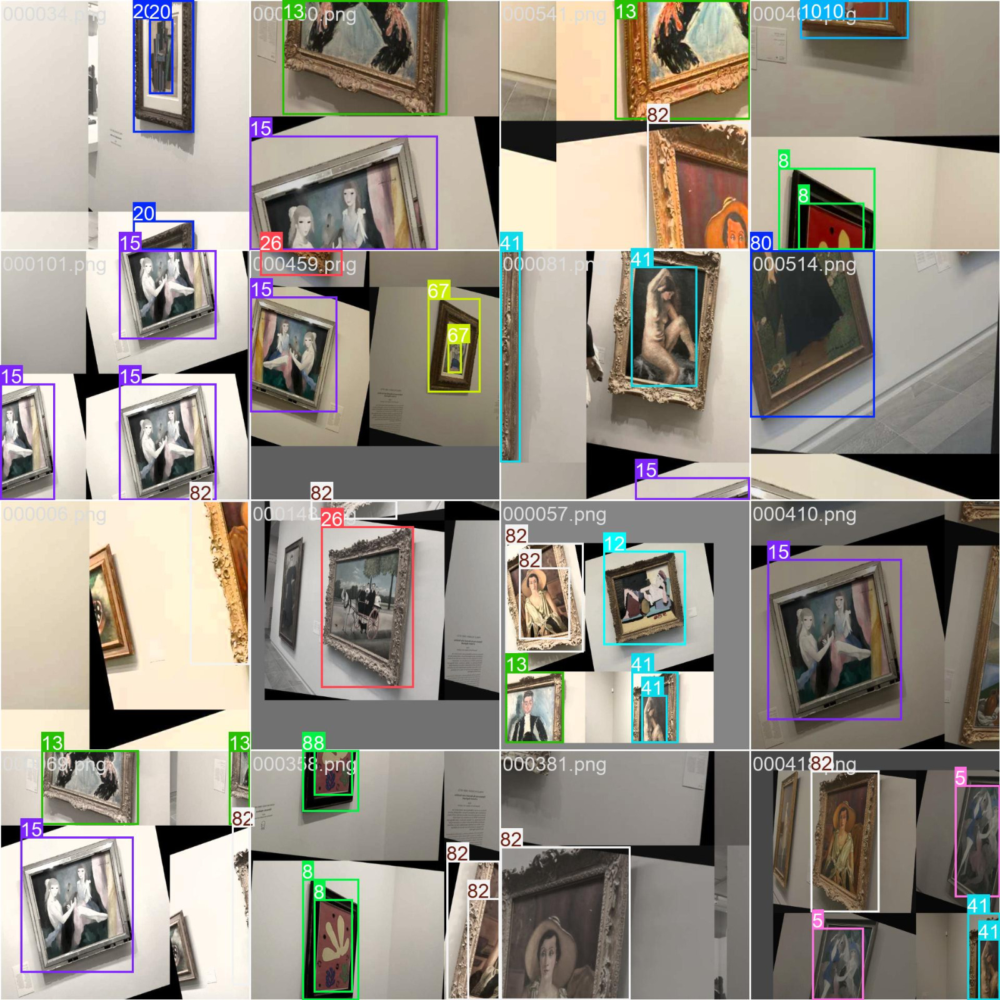
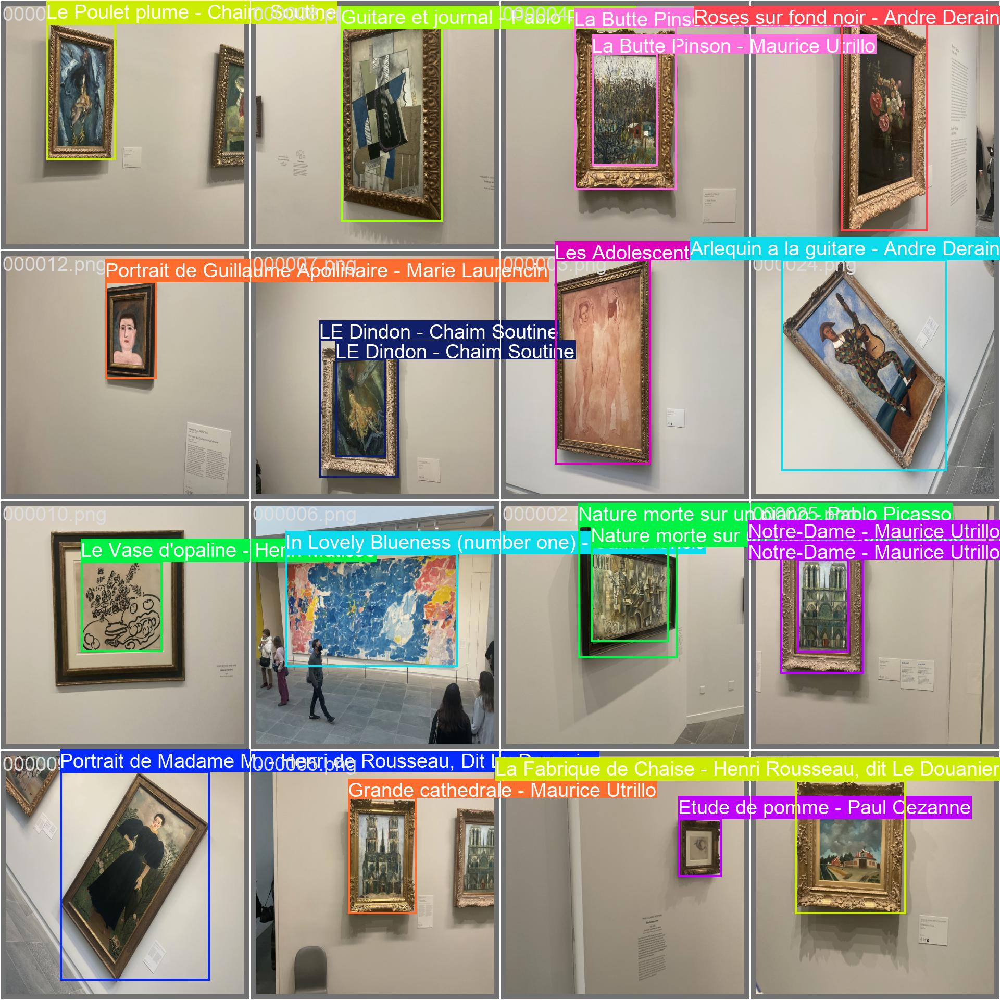
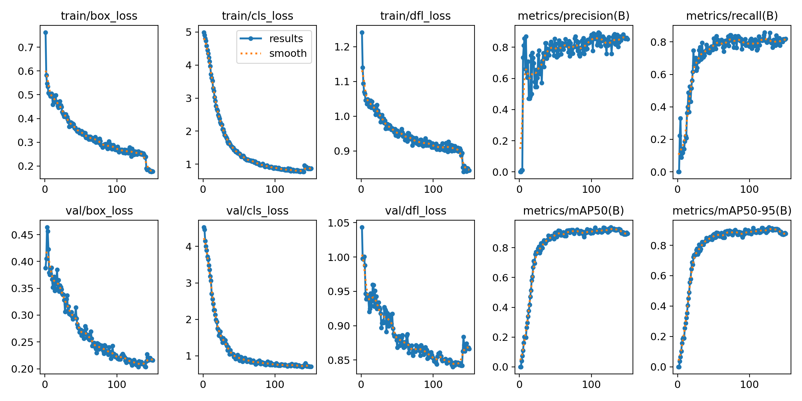

# LlamArt

Llam4rt recognizes artworks using the video feed. Once the user has selected something they would like to talk about, the image's extremely detailed description and data get fed into the LLM using Retrieval-Augmented Generation (RAG), allowing the user to chat about information revolving around the artwork.

# iOS App

Made with love by [Martin Mohammed](https://github.com/MartinMohammed).

[Click here for source code](https://github.com/lukalafaye/LlamArt/tree/main/ios-app)

# Yolo

- [Fine tuned model](model/finetuned-yolo.pt)
- [Dataset Musee de l'orangerie](https://huggingface.co/datasets/anand94ap/orangerie_museum_art_piece)
- [Training notebook](yolo-art-finetune.ipynb)

# LLM running on device with RAG

Llam4rt recognizes artworks using the video feed. Once the user has selected something they would like to talk about, the image's extremely detailed description and data get fed into the LLM using Retrieval-Augmented Generation (RAG), allowing the user to chat about information revolving around the artwork.

Refer to [tgenlis83/llam4rt-llm/](https://github.com/tgenlis83/llam4rt-llm/) for more information.

https://github.com/user-attachments/assets/fb16baa4-26bd-4258-8c2e-43000d5efc17

